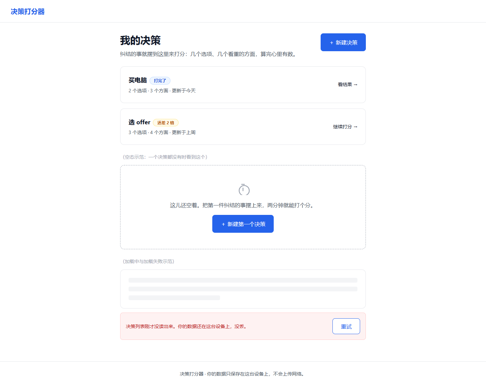
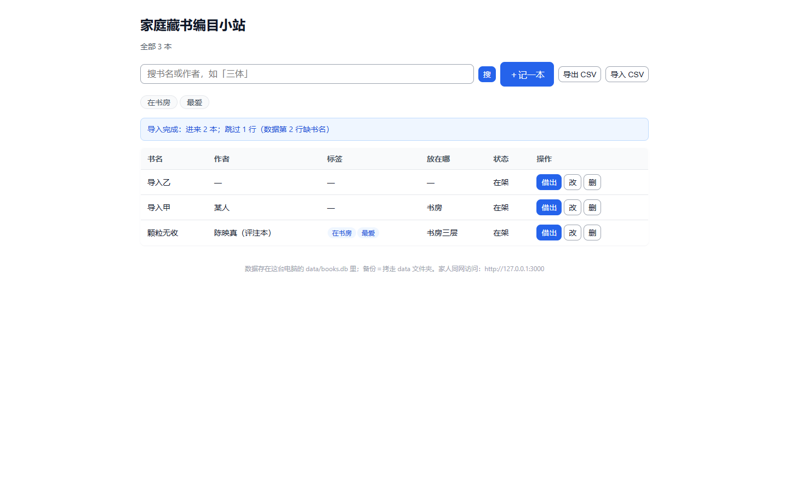
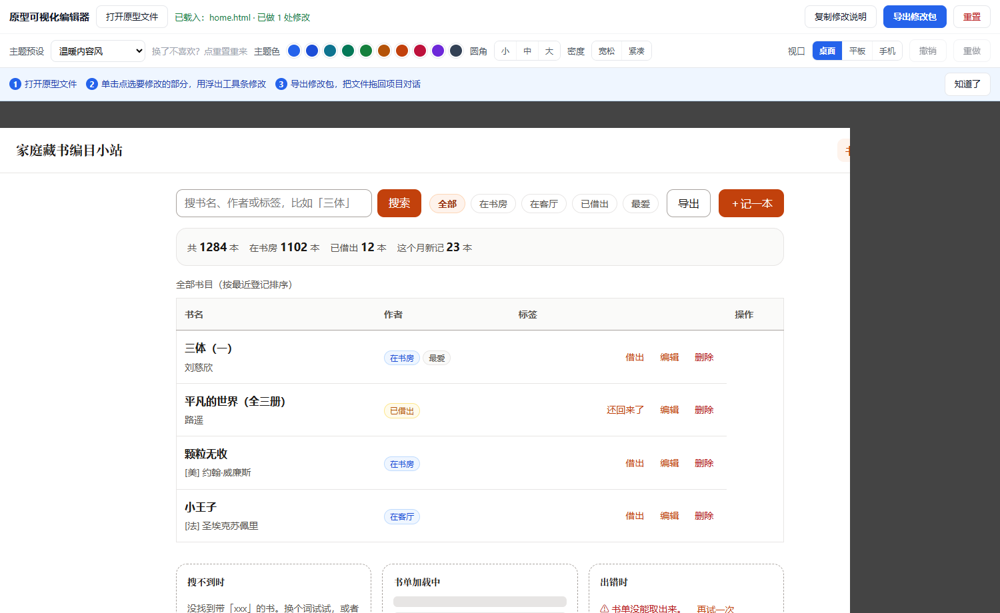

# idea2launch

**idea2launch** is an open-source agent plugin that takes a complete non-technical beginner from a raw idea to a **running web application plus full documentation**, through a 9-stage guided wizard where an AI agent plays every role of a software company — and every stage ends with a human sign-off gate.

> Status: v0.2.0 — M1 + M2 delivered, verified by two full sandbox runs (draft tier & production tier, G1→G9). 中文说明见下方正文。

## Why

Most "AI builds your app" tools assume you can read code and review a diff — non-technical users get a chat log instead of a product. idea2launch inverts the flow: due-diligence before code, documents instead of chat logs, and a human signature at every gate. A market survey (2026-10) found no existing tool combining idea questioning, a beginner-oriented wizard, sign-off gates, and self-hosted open source — that gap is this project (详见下方中文「核心差异化」).

## Features

- Idea due-diligence before any code (12-dimension advisory assessment with red-flag hard stops)
- 9-stage wizard with sign-off gates: return a stage, or roll back to the previous gate
- Resumable across sessions via a single state file (`state.json` + `decisions.log` + `.bak`)
- Draft tier / production tier (auto-adopted recommendations with rationale vs. full debate & review)
- Visual prototype editor (stage 3: restyle presets + in-place edits, every edit versioned)
- Research funnel for tech choices (first-hand comparison tables, AI-friendliness rated per option)
- Gap workbench (「以后再说」items tracked, adjudicated in plain language, fed into the next iteration)
- Dual shells: ZCode plugin + generic CLI host — thin shell, thick core, behavior-identical

## Quick Start

Prerequisites: an agent host (ZCode desktop/CLI, or any CLI agent that loads markdown skills) and Node.js ≥ 18.

**ZCode shell** — two install ways, see [shells/zcode/INSTALL.md](shells/zcode/INSTALL.md):

1. Repo-as-market (recommended, updates via `git pull`): add `<repo>/shells/zcode` as a local plugin market in ZCode → install **idea2launch** → reopen session;
2. Copy-complete (works when your ZCode copies plugins into cache): merge the shell and a copy of `core/` into one self-contained plugin folder → add & install.

**Generic CLI shell** — symlink or copy the skill into your host's skill directory; the `l3-hint.js` hook contract and `inject-global.js` are optional, see [shells/cli/INSTALL.md](shells/cli/INSTALL.md). Self-check: `node shells/cli/dryrun.mjs` must end with `0 failed`.

Then open a session in an empty working directory and say: **「启动 idea2launch」**.

## Screenshots

Two full sandbox runs ship with the repo history — a draft-tier build (决策打分器) and a production-tier build (家庭藏书编目小站, Express + SQLite):

| | |
|---|---|
|  |  |
| Draft tier: 决策打分器 | Production tier: 家庭藏书编目小站 |

Stage-3 visual editor: pick a style preset, edit in place — every change is versioned and re-signed at the gate.

## License

[MIT](LICENSE) — Copyright (c) 2026 idea2launch contributors

---

## 中文说明（正文）

### 项目一句话

**idea2launch** 是一个 MIT 开源插件：**智能体应用新手**（完全非技术）只带一个想法进来，智能体替代软件公司全角色（产品、架构、开发、测试、交付……），经 **9 阶段向导**交付**可运行的 Web 应用＋全套文档**（PRD／架构／测试／手册）。开工前先顾问式质疑你的想法，每阶段文档化＋人工签字闸门，跨会话可续跑。

### 功能清单

- **9 阶段向导**：立项评估 → 需求 → 设计 → 技术 → 计划 → 开发 → 质量 → 交付 → 轻运营，每阶段产出落盘（见下表）；
- **12 维质疑**：写第一行代码前，先对想法做 12 维顾问式评估＋红旗硬拦——明显不可行的事不开工；
- **签字闸门**：9 道阶段闸门＋3 个关键决策点，你签字才前进；可整阶段退回重做，也可回退上一道闸门；
- **双档运行**：草图档（关键决策自动采用推荐项并留痕，最快看到东西）／生产档（全流程辩论评审，认真做一个要上线的应用）；
- **可视化编辑器**：第 3 阶段直接在浏览器里改原型——换风格预设、拖改元素，每笔改动留痕、闸门重签；
- **调研漏斗**：技术选型不拍脑袋——四象限检索、一手来源对照表、AI 友好度逐项评级，摆给你拍板；
- **缺口工作台**：你说「以后再说」的事不会丢——登记在案、大白话逐条裁决（现在办／下期做／知情带过／撤销），自动汇入下一轮迭代需求；
- **双壳**：ZCode 插件壳＋通用 CLI 壳，壳薄核厚、行为一致，工序逻辑全在平台无关的 `core/`。

### 九阶段向导

| 阶段 | 产出 | 闸门 |
|---|---|---|
| 1 立项评估 | 12 维评估报告＋红旗标记 | 「继续 / 调整 / 转草图档 / 放弃」 |
| 2 需求 | PRD＋用户故事 | PRD 签字 |
| 3 设计 | 可点原型＋UI 规范 | 原型＋UI 规范 freeze |
| 4 技术 | 技术方案＋API 契约 | 技术栈定稿＋方案签字 |
| 5 计划 | 排期＋任务票＋风险登记 | 票批准 |
| 6 开发 | 代码＋构建日志 | 里程碑验收（可攒批） |
| 7 质量 | 测试报告＋大白话 UAT 清单 | UAT 签字 |
| 8 交付 | 一键运行包＋手册＋上线检查单 | 交付确认＋「下一步可发布」提示 |
| 9 轻运营 | 反馈页＋迭代入口 | 无强制闸门 |

### 双档运行

- **草图档**：砍辩论与评审，关键决策自动采用推荐项并留痕——最快看到东西。
- **生产档**：全流程辩论、评审、逐票验收——认真做一个要上线的应用。
- 启动时预告预计消耗，你选档。

### 双沙箱实测截图

以下截图来自仓库历史里的两次完整实战（非设计稿）：

*草图档产出《决策打分器》*

*生产档产出《家庭藏书编目小站》（真实 Express＋SQLite 后端）*

*第 3 阶段可视化编辑器：换预设＋就地改，改动留痕、闸门重签*

### 快速开始

前置：一个智能体宿主（ZCode 桌面版/CLI，或任意能装载 markdown 技能的 CLI 智能体）＋ Node.js ≥ 18。

**ZCode 壳**（两种装法，详见 [shells/zcode/INSTALL.md](shells/zcode/INSTALL.md)）：

1. **仓库即市场**（推荐，更新只需 git pull）：ZCode → 插件市场 → 添加 → 选 `<仓库>/shells/zcode` 目录 → 安装 **idea2launch** → 重开会话；
2. **复制补全**（宿主把插件复制进缓存导致「core 缺失」时用）：把壳内容＋`core/` 合成一个自包含目录再添加安装。

**通用 CLI 壳**：把技能目录链接或复制进宿主技能目录即可；`l3-hint.js` 钩子契约与 `inject-global.js` 注入询问可选，详见 [shells/cli/INSTALL.md](shells/cli/INSTALL.md)。装完自检：`node shells/cli/dryrun.mjs` 末行须 `0 failed`。

装好后在一个空目录开新会话，说：**「启动 idea2launch」**。

### 常见问题（FAQ）

**要会编程吗？**
不用。全程大白话：智能体写代码，你只负责回答问题、看对照表拍板、在确认页签字。每一步都翻译成「人话」，不懂的词直接问，它会解释。

**数据在哪？**
都在你自己的电脑上，不上传任何云端：项目进度档案在项目根的 `idea2launch/` 目录（state.json＋decisions.log＋备份）；做出来的应用的数据在应用自己的数据目录（如实测样例的 `data/books.db`）。卸载插件不会删项目档案，确认不要了手工删即可。

**怎么卸载？**
ZCode 壳：插件管理 → idea2launch → 卸载；CLI 壳：删掉宿主技能目录下的 `idea2launch/`。若首次运行注入询问时选过 **on**，再到宿主全局规则文件（如 `AGENTS.md`）把 idea2launch 注入段手工删除。细节见两份 INSTALL.md 的「卸载」节。

### 核心差异化

市场实查（2026-10）结论——四项组合空白，即本项目定位：

1. **想法质疑**：写代码前先做顾问式尽调（12 维评估＋红旗），不做明显不可行的事；
2. **外行人向导**：术语翻译、防呆确认、每步可回退、默认值友好，全程面向完全非技术用户；
3. **签字闸门**：9 个阶段闸门＋3 个关键决策点，人签字才前进，可退回可回滚；
4. **开源自托管**：纯 markdown 技能包＋状态文件，零运行时依赖，跑在你自己的智能体环境里。

对照组：开源 AI 软件公司类（MetaGPT/ChatDev/GPT Pilot/OpenHands）流程全但面向开发者；闭源外行人建应用类（Lovable/Bolt/v0/Replit Agent）有向导但闭源云托管、不质疑想法、无签字闸门。

### 架构

- `core/` 平台无关核心——纯 markdown 技能包（主工序状态机＋阶段细则＋角色卡＋规范包＋模板）＋状态机 schema；
- `modules/ui-spec/` 第 3 阶段（设计）子模块，可独立使用；
- `shells/` 双壳：ZCode 插件壳（M1）＋通用 CLI 壳（M2）；
- `docs/` 发布检查单与图片资产（[RELEASE-CHECKLIST.md](docs/RELEASE-CHECKLIST.md)）。

### 当前状态

- **M1 已关闸**（2026-10-04）：仓库骨架＋9 阶段细则＋状态机＋ZCode 壳，草稿档/生产档双沙箱全流程实战走通（含中断续跑）。
- **M2 已关闸**（2026-10-05）：技术/质量/交付三阶段深化＋通用 CLI 壳＋缺口裁决工作台；生产档全流程实战 G1→G9（真实 Express＋SQLite 应用，真浏览器 UAT 19/19＋自动化 25/25＋覆盖率 92.45%，含逐道回退与断点续跑实测）。
- 变更明细见 [CHANGELOG.md](CHANGELOG.md)；首次对外发布前的人工检查见 [docs/RELEASE-CHECKLIST.md](docs/RELEASE-CHECKLIST.md)。
